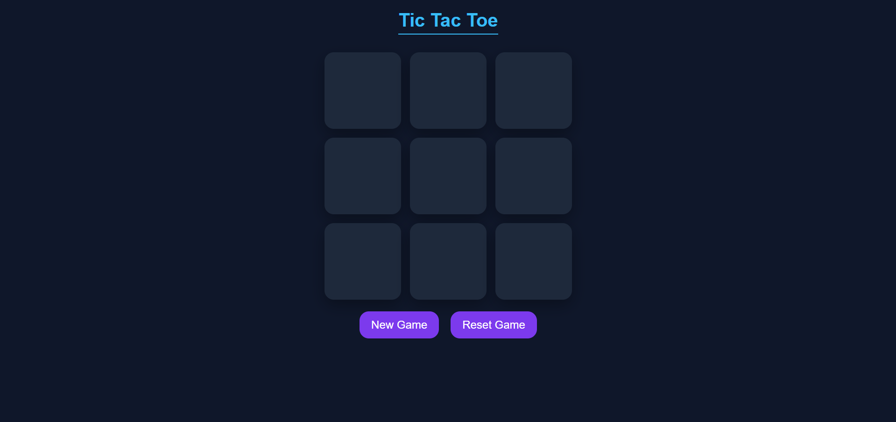

# 🎮 Tic-Tac-Toe Game

A simple and interactive Tic-Tac-Toe game built using HTML, CSS, and JavaScript.

## 🚀 Live Demo
👉 https://rishisingh108.github.io/Tic-Tac-Toe-Game/

## ✨ Features
- Start & Reset Game
- Winner Announcement
- Responsive UI
- Two Player Mode

## 🛠️ Technologies Used
- HTML
- CSS
- JavaScript

## 📌 How to Play
1. Player X starts the game
2. Players take turns marking the spaces
3. First to get 3 in a row wins
4. Click Reset to play again

## 📷 Screenshot

---

💡 Made with ❤️ by Rishi Singh
